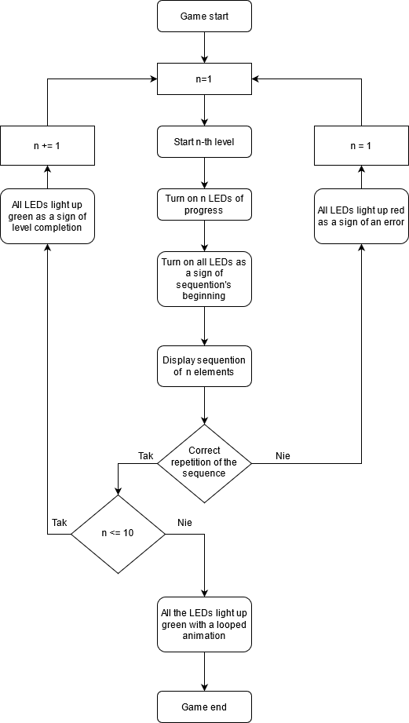
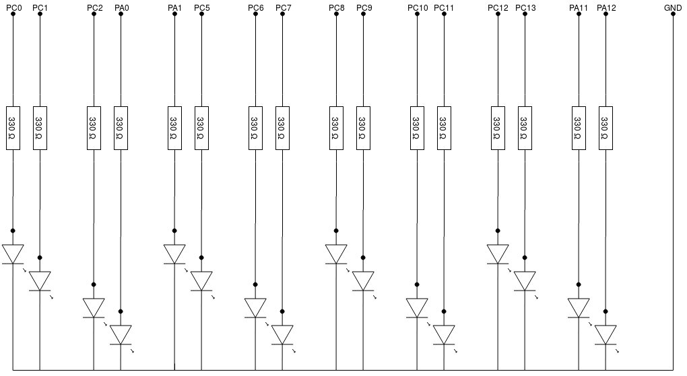
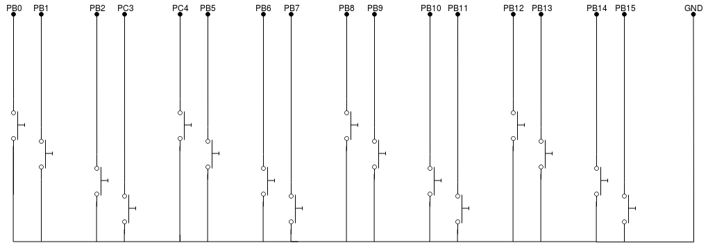
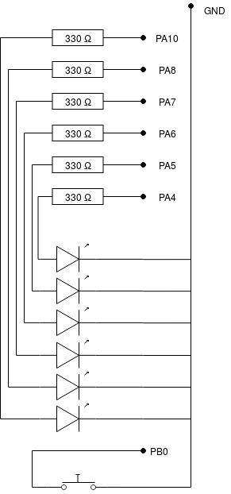
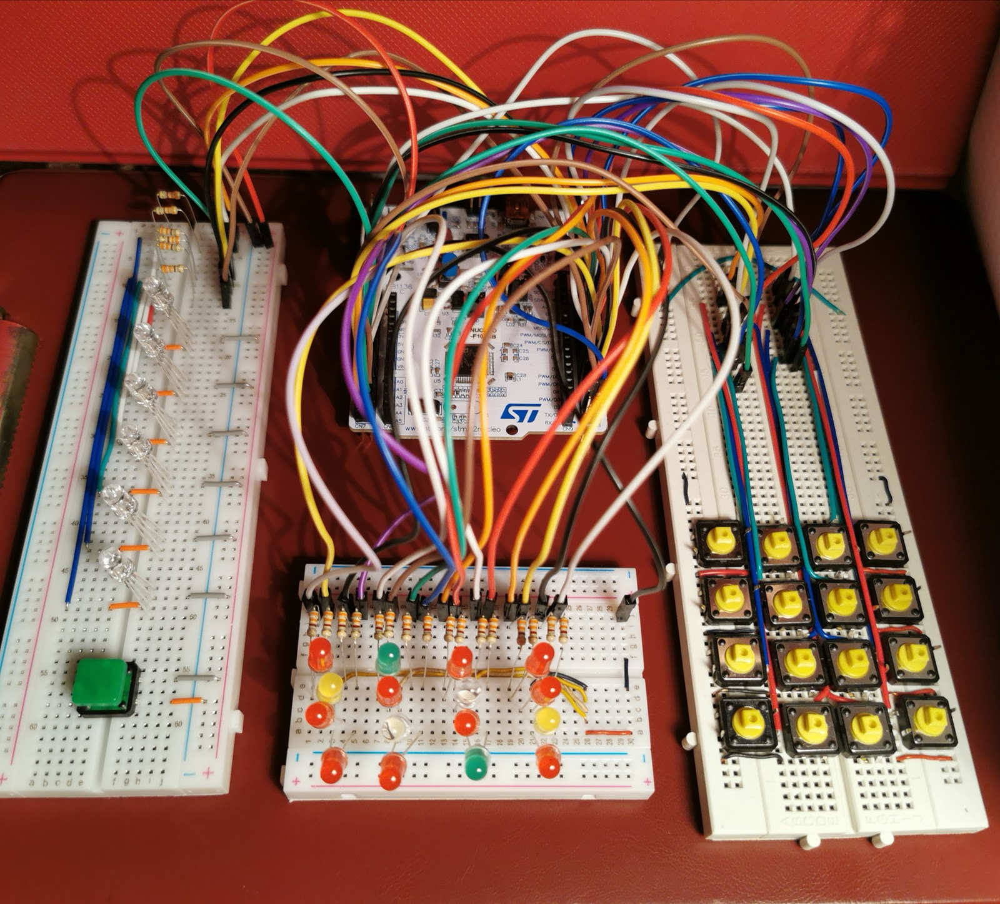
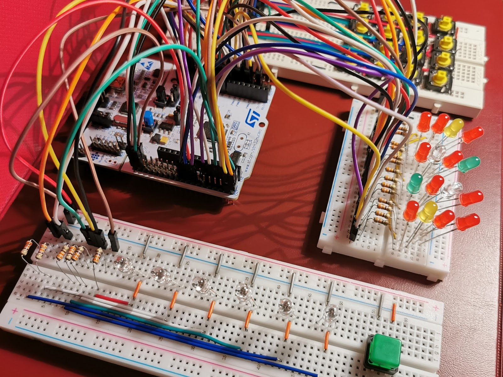
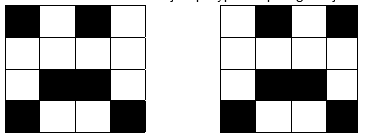
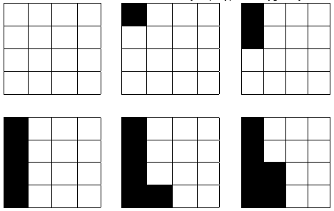

# Rhythm game device

The project aims to build a device that allows for a Rhythm game, i.e. a game aimed at repeating a given sequence in a specific way.

## Table of contents
* [Rhythm game device](#rhytm-game-device)
	* [Design assumptions](#design-assumptions)
	* [What you need](#what-you-need)
	* [Wiring diagram](#wiring-diagram)
	* [Source code description](#source-code-description)
	* [Summary](#summary)

## Design assumptions

In this project, the given sequence will be displayed by LEDs arranged in a matrix with dimensions of 4x4.

The user's goal will be to repeat the display of the LED sequence by pressing buttons arranged in a 4x4 matrix. Correct repetition of sequences means pressing them in the right order and at the right time (with a set tolerance, e.g. 0.5 seconds).

The game of repeating sequences can be divided into levels. Each level should repeat the sequence one move longer than the previous sequence. The user should be informed about the current level through a separate LED panel.

A bug should take you back to the first level and restart the game.

A necessary function should be a separate button to start the game.

The game scenario should look like shown in Figure below.

## What you need

The STM32F103RB chip is used in this project.
The buttons pressed by the user will be realized using the single buttons of the Tact Switch.
All available components are shown in Table below.

| Description with link                                                                                                                                                                                                                                                                                                                                                                                                                                                                                                                                                                                          | Number needed |
|----------------------------------------------------------------------------------------------------------------------------------------------------------------------------------------------------------------------------------------------------------------------------------------------------------------------------------------------------------------------------------------------------------------------------------------------------------------------------------------------------------------------------------------------------------------------------------------------------------------|---------------|
| Development board with a microcontroller: STM32F103RB                                                                                                                                                                                                                                                                                                                                                                                                                                                                                                                                                          | 1             |
| LED 5 mm RGB cathode https://botland.com.pl/pl/diody-led-rgb/547-dioda-led-5-mm-rgb-wsp-katoda.html                                                                                                                                                                                                                                                                                                                                                                                                                                                                                                         | 22            |
| Tact Switch 12x12mm with a cap - square blue / red / green / white / yellow https://botland.com.pl/pl/tact-switch/11131-tact-switch-12x12mm-z-nasadka-kwadrat-niebieski-5szt.html https://botland.com.pl/pl/tact-switch/11132-tact-switch-12x12mm-z-nasadka-kwadrat-bialy-5szt.html https://botland.com.pl/pl/tact-switch/11133-tact-switch-12x12mm-z-nasadka-kwadrat-zolty-5szt.html https://botland.com.pl/pl/tact-switch/11134-tact-switch-12x12mm-z-nasadka-kwadrat-czerwony-5szt.html https://botland.com.pl/pl/tact-switch/11140-tact-switch-12x12mm-z-nasadka-kwadrat-zielony-5szt.html  | 25            |
| Bracket for 400/800 holes http://botland.com.pl/plytki-stykowe/56-plytka-stykowa-400-otworow.html                                                                                                                                                                                                                                                                                                                                                                                                                                                                                                           | 1/2           |
| Resistors - 330Ω                                                                                                                                                                                                                                                                                                                                                                                                                                                                                                                                                                                               | 22            |
| 20 cm female-male connecting cables                                                                                                                                                                                                                                                                                                                                                                                                                                                                                                                                                                            | 42            |
| Jumpers of different lengths                                                                                                                                                                                                                                                                                                                                                                                                                                                                                                                                                                                   | 65            |

## Wiring diagram

The microcontroller development board, STM32F103RB, has 16 pins for ports A, B, C and 3 pins for port D. Although these are I/O pins, some are reserved for specific functions and cannot be used in this project .

The pins that can be used to operate the buttons and LEDs are:
* PA0, PA1, PA4-PA8, PA10-PA12,
* PB0-PB2, PB4-PB15,
* PC0-PC13,
* PD2.

The total number of pins that can be used for an I/O operation is 39.
This makes it possible to use these pins as follows:
* 16 pins for a 4x4 diode matrix,
* 16 pins for a 4x4 button matrix,
* 6 pins per line of LEDs indicating the level,
* 1 pin for the start button.

The above-mentioned elements can be divided into 3 modules:
* sequence display module - matrix of buttons,
* sequence reading module - matrix of diodes,
* level indication module - level indicator LEDs and start button.

Figures below show the prepared connection diagrams for each module.

Sequence display module:

Sequence reading module:

Level indication module:

The implementation of the above diagrams is presented in Figures below, which show the execution of each of the modules on separate contact plates.

## Source code description

In this chapter, the code written in C will be described. All functions have been divided into sections such as:
* instructions responsible for configuring PINs,
* instructions responsible for handling interrupts,
* instructions responsible for configuring the timer,
* instructions responsible for controlling the LEDs,
* instructions responsible for the elements of the game.

### Instructions responsible for configuring PINs

This is the section in `main.c` that is labeled "leds and buttons". It starts with connecting the clock cycle to ports A, B, C and D.

	__HAL_RCC_GPIOA_CLK_ENABLE();
	__HAL_RCC_GPIOB_CLK_ENABLE();
	__HAL_RCC_GPIOC_CLK_ENABLE();
	__HAL_RCC_GPIOD_CLK_ENABLE();

In the following lines, ports are assigned to LEDs or buttons from appropriate modules.

Each PIN responsible for controlling the diode has the Mode attribute set in the Output mode with the pull-up resistors turned off. This can be achieved with the lines below.

	gpio_matrix_leds.Mode = GPIO_MODE_OUTPUT_PP;
	gpio_matrix_leds.Pull = GPIO_NOPULL;
	gpio_matrix_leds.Speed = GPIO_SPEED_FREQ_LOW;

The LEDs from the sequence display module are served by the PINs in Table below:

| 0: PC0 | 4: PA1 | 8: PC8   | 12: PC12 |
|--------|--------|----------|----------|
| 1: PC1 | 5: PC5 | 9: PC9   | 13: PC13 |
| 2: PC2 | 6: PC6 | 10: PC10 | 14: PA11 |
| 3: PA0 | 7: PC7 | 11: PC11 | 15: PC12 |

The PINs responsible for controlling the LEDs from the level indicating module are presented in Table below:

| 0: PA4 | 1: PA5 | 2: PA6 | 3: PA7 | 4: PA8 | 5: PA10 |
|--------|--------|--------|--------|--------|---------|

Each PIN responsible for reading the state of the buttons has been configured to cause an interrupt when pressed (rising edge) with the pull-up resistors turned on. This can be achieved through the lines of code below.

	gpio_matrix_button.Mode = GPIO_MODE_IT_RISING;
	gpio_matrix_button.Pull = GPIO_PULLUP;
	gpio_matrix_button.Speed = GPIO_SPEED_FREQ_LOW;

Due to the fact that when pressing the buttons, the interrupts generated cannot distinguish on which port the interrupt occurred, it was necessary to use all available PINs (0-15). The assignment of the PINs to the buttons from the sequence reader is presented in Table below:

| 0: PB0 | 4: PC4 | 8: PB8   | 12: PB12 |
|--------|--------|----------|----------|
| 1: PB1 | 5: PB5 | 9: PB9   | 13: PB13 |
| 2: PB2 | 6: PB6 | 10: PB10 | 14: PB14 |
| 3: PC3 | 7: PB7 | 11: PB11 | 15: PB15 |

The PB0 PIN has been selected for operating the start button from the level indicator module. It also supports one of the buttons on the sequence reader. This is because it does not distinguish between the ports where the interrupt arrives. The double function by one button has been resolved in such a way that when reading the sequence, the interruption causes the next button to be read from the sequence, and after an error it is a signal that starts the game anew (i.e. depending on the game state, the interrupt from PIN BP0 may have 2 different results).

### Instructions responsible for handling interrupts

Interrupts can be triggered by PIN numbers 0-15. For this reason it is necessary to start reading external interrupts through the lines in the `main.c` file:

	HAL_NVIC_EnableIRQ(EXTI0_IRQn);
	HAL_NVIC_EnableIRQ(EXTI1_IRQn);
	HAL_NVIC_EnableIRQ(EXTI2_IRQn);
	HAL_NVIC_EnableIRQ(EXTI3_IRQn);
	HAL_NVIC_EnableIRQ(EXTI4_IRQn);
	HAL_NVIC_EnableIRQ(EXTI9_5_IRQn);
	HAL_NVIC_EnableIRQ(EXTI15_10_IRQn);

For each group of PINs, it is necessary to handle the PINs of each number through the instructions in the `stm32fxx_it.c` file. For example, below are the interrupt handling instructions for PINs in the 5-9 range.

	void EXTI9_5_IRQHandler(void)
	{
		HAL_GPIO_EXTI_IRQHandler(GPIO_PIN_5);
		HAL_GPIO_EXTI_IRQHandler(GPIO_PIN_6);
		HAL_GPIO_EXTI_IRQHandler(GPIO_PIN_7);
		HAL_GPIO_EXTI_IRQHandler(GPIO_PIN_8);
		HAL_GPIO_EXTI_IRQHandler(GPIO_PIN_9);
	}

The HAL library uses the `HAL_GPIO_EXTI_Callback` function to handle external interrupts. It is called for each input and the pin number is its parameter.

Each button has a flag assigned to it, stored by the following variables:

	bool matrixButtons[16] = {false};
	bool startButton;

When a given button is pressed, its flag is set to `true`. This is done in the `HAL_GPIO_EXTI_Callback` function.

Calling the `resetButtonsFlags()` function sets all buttons responsible for the buttons to `false`.

### Timer configuration instructions

The STM32F103 chip has 4 timer modules. In this project, TIM2 was used. The system clock runs at 8 MHz. Second was chosen as the duration of one iteration. For this purpose, the counter has been configured to count down to 6000 and cause an interrupt every such period.

This was achieved with the following instructions from the `main.c` file:

	__HAL_RCC_TIM2_CLK_ENABLE();
	tim2.Instance = TIM2;
	tim2.Init.Period = 1000 - 1;
	tim2.Init.Prescaler = 6000 - 1;
	tim2.Init.ClockDivision = 0;
	tim2.Init.CounterMode = TIM_COUNTERMODE_UP;
	tim2.Init.RepetitionCounter = 0;
	tim2.Init.AutoReloadPreload = TIM_AUTORELOAD_PRELOAD_DISABLE;
	HAL_TIM_Base_Init(&tim2);
	HAL_NVIC_EnableIRQ(TIM2_IRQn);
	HAL_TIM_Base_Start_IT(&tim2);

The interrupts are handled by the `HAL_TIM_PeriodElapsedCallback` function. Depending on the set flags, the program is to turn on or off the LEDs and read the flags of pressed buttons.

The flags used in the program are:
* `startButton` - `true` if the start button was pressed, otherwise `false`,
* `matrixButtons[i]` - `true`, if the button for reading sequence number i was pressed, otherwise `false`,
* `error` - `true` if an error was made while entering the sequence by the user, otherwise `false`,
* `play` - `true` if a game is in progress, `false` otherwise,
* `show` - `true` value if the sequence of lit LEDs is displayed, otherwise `false`,
* `read` - `true` if reading the pressed sequence of buttons is in progress, otherwise `false,
* `startRead` - value `true`, the user has already started pressing the sequence, otherwise the value is `false` (if the value of the `read` is set as true and `startRead` is `false`, the user waits for the user to start entering the sequence),
* `won` - `true` if the player has completed all levels of the game, `false` otherwise.

These flags allow the `HAL_TIM_PeriodElapsedCallback` function to execute the game scenario.

	void HAL_TIM_PeriodElapsedCallback(TIM_HandleTypeDef *htim)
	{
		if(startButton && (!play || error))
		{
			firstStage();
		}
		if(play && !error)
		{
			if(show)
			{
				showSequence();
			}
				else if(read)
			{
				readSequence();
			}
		}
		if(error)
		{
			loseAnimation();
		}
		if(won)
		{
			wonAnimation();
		}
	}

### Instructions responsible for controlling the LEDs

In the code in `main.c` one of the leading sections are "toggle / reset led functions" and "end animations". The first one contains functions that change the state of individual LEDs, and the second one displays an animation in the event of a failure (user error, error) or victory (completion of the last level).

The function `toggleMatrixLed(int n)` changes the LED status of the sequence display module with the number `n` .

The `resetMatrixLeds()` function turns off all LEDs from the sequence display module.

The function `toggleStageLed(int n)` changes the lighting status of the LED from the level indicating module `n`.

The `resetStageLeds()` function extinguishes all LEDs from the level indicator module.

`loseAnimation()` displays an error animation. The animation consists of two displayed frames. It is a "sad face" with eyes turned left or right. Frame selection is done by checking the parity of time, which is an integer and increments by 1 with each iteration. Both frames of this animation are presented in Table below:

The `wonAnimation()` function displays an animation to indicate that you have won. The animation consists of 17 displayed frames. It is a snake that slalom across all fields of the 4x4 matrix. The time variable is also used for execution. The first 6 frames are shown in Table below:

### Instructions responsible for the elements of the game

Functions that perform the most important elements of the game have been implemented in the `main.c` file in the "scenario functions" section. Before describing them, it is worth mentioning the global variables, thanks to which the states of the game are saved after each iteration, information about the sequences drawn and the level of difficulty.

The variables that define the level of difficulty are:
* `easy` - if it is set to `true`, one sequence is drawn for the whole single game and it is extended by only one element on subsequent levels. If set to `false`, then at each level a new sequence is drawn one element longer than the previous one.
* `really_hard` - if set to `false`, the duration of each element of the sequence is one iteration (default). Otherwise (`true`), the duration of each element of the sequence is randomized and may take one or two iterations. This involves pressing the buttons at the same or different intervals.
* `firstLength` - this is a variable that specifies the length of the sequence in the first levels. It defaults to 3.

Variables needed to write and read sequences:
* `randomLeds[10]` - an array that stores up to 10 values, which are the numbers of sequentially lighting up LEDs. For each individual game its values are randomized.
* `randomDurations[10]` - an array that holds the duration of each element of the sequence. By default, all elements are equal to 1, but when `really_hard` is `true` then those values are random and equal to 1 or 2.
* `repeatDurations[10]` - an array that stores the elapsed times of sequences when they are displayed or read. At the beginning of display/reading, all array elements are equal to 0 and increment until they are equal to their corresponding elements in `randomDurations[10]`.

Other variables:
* `stage` - variable equal to the number of the current level. At the beginning of each individual game, it is equal to 0 and increases by 1 for each level completed by the user.
* `time` - a variable that counts past iterations. It serves only to display the correct animation frames.

The `randomSingleLed(int i)` function - triggering it results in the drawing of the i-th sequence element, i.e. the diode number and duration. The drawing excludes the possibility of the same LED appearing more than once in the sequence (drawing without repetitions).

Function `randomSequence(int n)` - calling it results in drawing the sequence for the nth level. It takes into account the flags `easy`, `really_hard`, and the value `firstLength`.

`firstStage()` function - calling it results in starting the game from the beginning, from the first level. It consists in turning off the LEDs from the sequence display module and indicating the level and setting the appropriate flags - first of all, setting the `error` flag to `false` and the `play` and `show` flags to `true`. It is also within the scope of this function to draw the initial sequence by calling the `randomSequence(stage)` function with the stage variable set to 0.

The job of the `nextStage()` function is to increment the value of stage by 1 and check that the last stage has not completed. If the game is over then the `won` flag is set to `true` and the `play` flag to `false`. The remaining steps are drawing the next element of the sequence and setting the remaining flags, similarly to the `firstStage()` function.

The `showSequence()` function is responsible for lighting the appropriate LEDs when displaying the sequence. The information in which part of the sequence is currently displayed is read thanks to the `repeatDurations[]` table, which initially stores all zeros, but in subsequent iterations successive elements of this table are incremented by 1 until the appropriate value stored in the `randomDurations` table is reached. If the next element of the sequence starts to be displayed, the function turns on the corresponding LED and turns off the LED corresponding to the previous element. After displaying the last element of the sequence, the function changes the value of the `read` flag to `true` - this starts waiting for the button to be pressed by the user, i.e. calling the `readSequence()` function in subsequent iterations instead of `showSequence()`. The values ​​stored in the `repeatDurations[]` array are also reset, so that they can be used in a similar way in the `readSequence()` function.

The `readSequence()` function is responsible for reading the sequence of buttons pressed by the user. As long as the `startRead` flag is false, the program is expected to press the first button corresponding to the first element of the sequence. If the wrong button is pressed, the function changes the `error` flag to `true`. If the appropriate button is pressed, the program starts checking whether the user in subsequent iterations presses those buttons that correspond to the appropriate sequence elements. This change is made by setting the `startRead` flag to `true`.

In subsequent calls, the `readSequence()` function checks whether this is the iteration in which the button corresponding to the next element of the sequence should be pressed, or whether no button should be pressed in that iteration. In the latter case, the function sets the `error` flag to `true` if any button was pressed. In the first case, if the user presses the wrong button, the `error` flag is set to `true`. If the user presses a good button in the appropriate iteration, the LED corresponding to the sequence element lights.

## Summary
The project was successfully completed. The intended goals have been achieved. An example of a few rounds played is presented in the video:
https://drive.google.com/file/d/13chryiWfTkNFa7CC_dILX5erGfCd5XCu/view?usp=sharing.

The problem that could not be solved is the reading of pressing the button marked with the number 15, i.e. associated with the PB15 PIN. Pressing it does not interrupt, which is a mistake. The button itself is functional, which was tested by attaching other PINs to it. It was not possible to bypass this error using PINs PA15 and PC15, because in these cases also no interrupt was triggered. In order to avoid this error, the LED number 15 was excluded from the randomized sequences (which is only a temporary solution).
